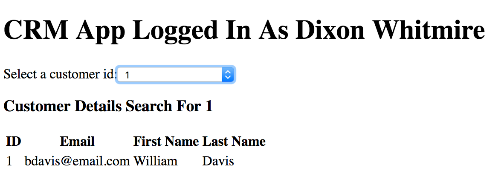

# azure-ad-b2c-ui

A simple [Vue.js](https://vuejs.org/v2/guide/) based UI which integrates with [Azure AD B2C](https://azure.microsoft.com/en-us/services/active-directory-b2c/) for
authentication/authorization services. The UI consumes data from a [Spring Boot Microservice](https://github.com/dixonwhitmire/azure-ad-b2c-microservice).

The current release, 1.0,  is a baseline release which supports Vue.Js integration with Spring Boot without Azure AD B2C integration. Azure AD B2C integration
is supported in the 2.0 release.

## The UI

The award-winning, minimal UI is used to demo integrations with Azure AD B2C and a Spring Boot Microservice.

- The header includes the user display name, which is parsed from the Azure AD B2C JWT token
- The drop-down list is used to fetch data for a single customer using the [Sample Customer Microservice](https://github.com/dixonwhitmire/azure-ad-b2c-microservice)



## Project setup

Complete the setup steps for:
- [Azure AD B2C](https://github.com/microsoft/azure-spring-boot/tree/master/azure-spring-boot-samples/azure-active-directory-b2c-oidc-spring-boot-sample)
- [Sample Customer Microservice](https://github.com/dixonwhitmire/azure-ad-b2c-microservice)

### Install application dependencies
```
npm install 
```

### Compiles and hot-reloads for development
```
npm run serve
```

### Compiles and minifies for production
```
npm run build
```

### Run your unit tests
```
npm run test:unit
```

### Lints and fixes files
```
npm run lint
```

### Customize configuration
See [Configuration Reference](https://cli.vuejs.org/config/).
